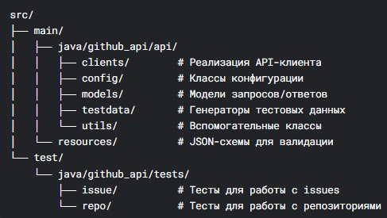
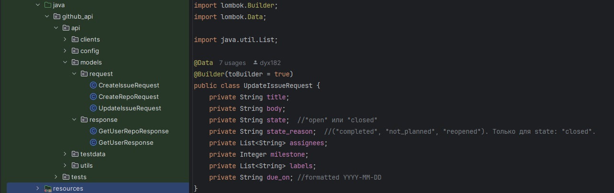
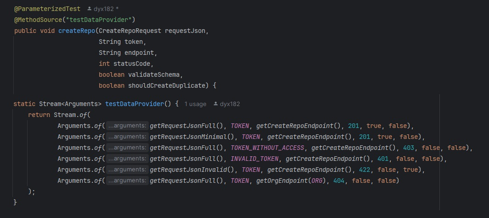
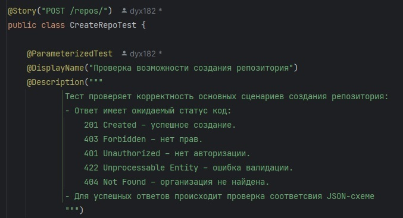
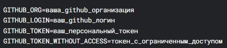

# Автоматизированные тесты GitHub API

Набор API-тестов для платформы GitHub, охватывающих ключевые сценарии работы с репозиториями и задачами (issues). Реализован с использованием современных инструментов тестирования REST API с применением паттерна Client-Server Model.
Данный проект можно использовать в качестве шаблона для проеката автотестов для приложения с REST API архитектурой.

## Содержание
1. [Технологический стек](#технологический-стек)
2. [Структура проекта](#структура-проекта)
3. [Особенности реализации](#особенности-реализации)
4. [Покрытие тестами](#покрытие-тестами)
5. [Установка и запуск](#установка-и-запуск)

## Технологический стек
- **RestAssured** 5.4.0 - Основной фреймворк для API-тестирования
- **JUnit 5** - Запуск тестов
- **Maven** - Сборка проекта
- **Allure Report** 2.24 - Отчётность
- **Lombok** 1.18.30 - Для уменьшения шаблонного кода
- **Dotenv** - Управление конфигурацией окружения

## Структура прокекта

## Особенности реализации
- **Гибридная Client-Server Model** с разделением на слои клиентов, моделей и тестов
- **Data Transfer Objects** для безопасной передачи тестовых данных между слоями c применением Lombok для сокращения шаблонного кода

- **Параметризованные тесты** с применением MethodSource для покрытия различных сценариев

- **Allure** для детализацией шагов выполнения и приложенными запросами/ответами

## Покрытие тестами
- Полное покрытие основных операций для репозиториев
- Тестирование всех основных вариантов работы с issues (задачами)
- Проверка различных сценариев авторизации и прав доступа
- Валидация ответов API по JSON-схемам

## Установка и запуск
1. Клонировать репозиторий:

git clone https://github.com/your-repo/github-api-tests.git
Создать файл .env в корне проекта с переменными:

Запустить тесты:
mvn test

Сгенерировать отчет Allure:
mvn allure:serve
